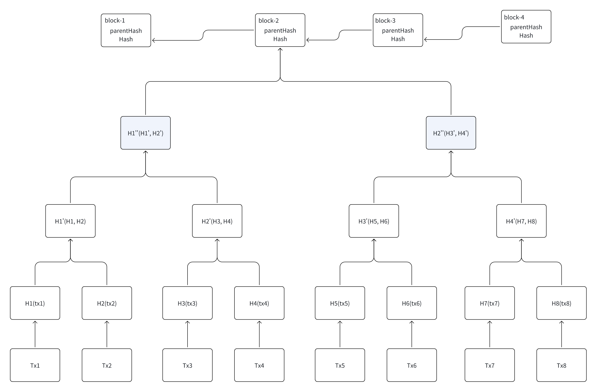

# 第三节：区块链的基本原理与特征

## 一.区块链的链式结构

区块链（Blockchain）是一种**分布式数据库技术**，本质上是一个由多个区块组成的链式结构，每个区块中存储着一组交易数据，并与前一个区块通过密码学手段相连接，形成“区块+链”的结构。

> 通俗理解：区块链就是“全网共用的一本公开账本”，记录了每一笔交易，所有人都可以查看，但无法随意篡改。

## 二.区块链的基本原理

### 1. 链式数据结构（Block + Chain）
- 每个区块都包含：
  - 当前交易数据
  - 前一个区块的哈希值
  - 时间戳、随机数等
- 区块之间通过哈希链接，构成一条“链”
- 修改一个区块会导致整个链断裂，易被发现

### 2. 哈希算法（Hash Function）
- 将任意长度的数据转化为固定长度的字符串
- **单向性**：不可逆
- **抗碰撞性**：不同内容不应生成相同哈希
- 保证数据**防篡改**

### 3. 共识机制（Consensus Mechanism）
> 多节点如何就“哪一条链才是真实的账本”达成一致

常见的共识机制：
- **PoW（工作量证明）**：挖矿，算力竞争（如比特币）
- **PoS（权益证明）**：根据质押代币比例选出验证者（如以太坊 2.0）
- **DPoS、PBFT、PoA、PoH、ZKP、Rollup 等**：为不同场景设计的共识算法

### 4. 分布式存储（Distributed Ledger）
- 所有节点都保有完整账本
- 无需中心服务器
- 任意节点宕机不会影响整体运行

### 5. 加密签名（公钥 + 私钥）
- 每个账户通过密钥对管理身份和资产
- 交易需用私钥签名，确保数据来源真实、不可否认
- 公钥可用于验证签名

## 三.区块链的主要特征

### 1. 去中心化（Decentralized）
- 不依赖中央机构或第三方平台
- 所有节点地位平等，独立验证交易

### 2. 不可篡改（Immutable）
- 区块一旦写入就无法更改
- 修改一个区块会导致后续所有区块哈希值变化
- 篡改需要控制全网多数节点，几乎不可能

### 3. 公开透明（Transparent）
- 账本对所有参与者公开
- 所有交易都可查可验
- 增强信任机制

### 4. 可追溯（Traceable）
- 每一笔交易都可追溯到起点
- 易于溯源、防止欺诈
- 广泛应用于供应链、司法、金融等场景

### 5. 安全性高（Secure）
- 利用密码学机制保障交易数据的保密性与完整性
- 区块链网络越大越安全（拜占庭容错）

## 四.区块链的核心价值

| 特征       | 带来的价值                       |
|------------|----------------------------------|
| 去中心化   | 降低对中介机构的依赖，防止垄断   |
| 不可篡改   | 增强数据可信度，防止事后作弊     |
| 公开透明   | 所有交易可验证，提升信任         |
| 可追溯     | 容易审计、便于监管与溯源         |
| 安全性     | 抗攻击强、保障资产和身份安全     |

## 五.区块链与传统数据库的对比

| 项目             | 传统数据库       | 区块链                 |
|------------------|------------------|------------------------|
| 架构             | 中心化           | 去中心化              |
| 数据控制         | 由中心管理       | 所有节点共同维护      |
| 数据篡改         | 容易被篡改       | 几乎不可篡改          |
| 信任机制         | 依赖机构信用     | 依赖算法与共识        |
| 数据可见性       | 部分可见         | 完全公开（视链类型）  |
| 效率             | 高               | 相对较低              |

## 六、小结

区块链不是“万能药”，但它提供了一种全新的信任构建方式：

> 用技术代替“信任”，实现数据的可信传输与资产的可信交换。

区块链技术正在逐步走出加密货币的圈子，向金融、政务、物流、版权、医疗等多个行业扩展，成为未来数字社会的基础设施之一。
