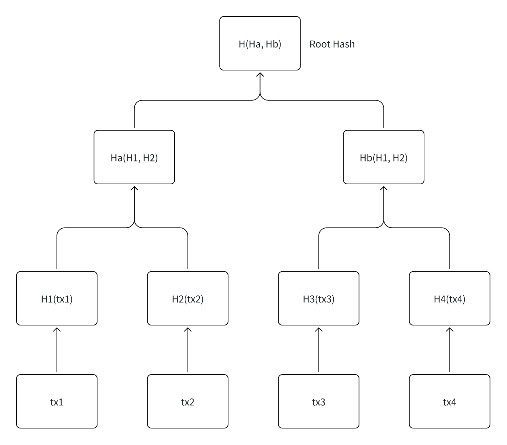
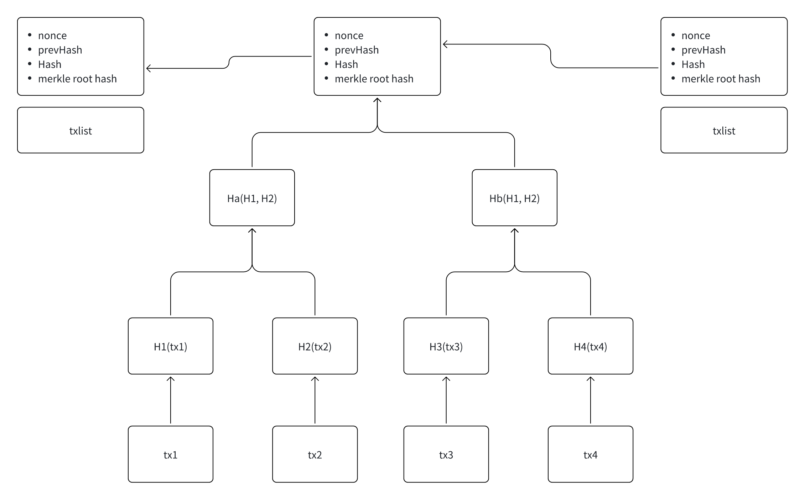

# 作者信息

| 用户名 | 推特 | 真实名字 | 简介 |
|--------|---------|------|--------|
| Seek | seek_web3 | ShiJiang.Guo | DappLink and The Web3 创始人, 曾就职于 Mantle, Bybit, 昆仑万维, HBTC, 币信, ChainUp, 云控蜂核, Achain, Linkeye, Kcash, Biwork, 华夏银行,中信银行|

# 第二节：Merkle 树与 Merkle Proof

## 一.Merkle 树简介  

Merkle 树（又称 **哈希树**）是一种结合 **二叉树 (Binary Tree)** 与 **哈希指针 (Hash Pointer)** 的复合数据结构。  
其核心思想是：**对叶子数据做哈希，然后自底向上两两哈希，直至得到唯一的根哈希（Merkle Root）**。任何叶子或中间节点被篡改都会引起根哈希变化，因而可用于完整性校验。

### 关键特性
| 特性 | 说明 |
| ---- | ---- |
| **防篡改** | 修改任意叶子 → 其父链上的哈希全部改变 → 根哈希失效 |
| **轻量验证** | 只需提供与目标叶子同层级的兄弟哈希即可构建验证路径（Merkle Proof），无需遍历全量数据 |
| **并行友好** | 叶子哈希可并行计算；树高为 _log₂ n_，验证复杂度低 |

### 通用应用场景
- 区块链交易列表完整性
- 大文件分片校验（IPFS／BT）
- 去中心化存储、Rollup 数据可用性证明
- 零知识电路中的承诺结构

## 二.Merkle Tree 在比特币中的应用  

在比特币，每个区块包含 **交易列表 → Merkle Tree → Merkle Root → 写入区块头** 的流程。

### 1.构建树
- 对所有交易做 `double-SHA256`（两次 SHA-256）得到叶子哈希。  
- 叶子数为奇数时复制最后一项填充，使层级节点为偶数。  
- 自底向上两两拼接并 `double-SHA256` 直到获得 `Merkle Root`。  

### 2.写入区块头
- 区块头字段：`[Version | PrevBlockHash | MerkleRoot | Time | Bits | Nonce]`  
- 只要任一笔交易被修改，`MerkleRoot` 即改变，导致整个区块哈希重算，进而破坏后续链条的工作量证明——**篡改成本极高**。

### 3.SPV(简易支付验证)
轻节点仅保存区块头 & 感兴趣交易的 Merkle Proof：  
- 网络返回包含交易 `Tx` 的区块头 + 证明路径（兄弟哈希）。  
- 轻节点本地还原根哈希，与区块头 `MerkleRoot` 对比，若一致则确认交易存在。  
- 不需下载完整区块，极大节省带宽和存储。

## 三.Merkle Tree 的其他应用场景  

| 场景 | 说明 |
| ---- | ---- |
| **空投合约 (Airdrop)** | 常见做法：链下生成参与地址+额度的 Merkle Tree，将 `MerkleRoot` 固化在合约；用户提交地址、额度及 Merkle Proof 即可在链上验证和领取，无需巨额链上存储 |
| **Celestia 命名空间 Merkle Tree** | Celestia 的 **Namespaced Merkle Tree (NMT)** 在节点的哈希值中加入命名空间前缀，支持按命名空间验证区块数据可用性与隔离性 |
| **Taproot Merkle 抽象语法树 (MAST)** | Taproot 将复杂支出条件（脚本分支）组织成 Merkle Tree，只在链上公开执行分支的哈希与路径，减少区块链数据泄漏并降低手续费 |
| **Layer-2 / Rollup** | Rollup 将 L2 交易集合打包，生成 `stateRoot` / `txRoot` 上链；若使用 zk-Rollup，还可将树根与零知识证明一起提交 |
| **去中心化存储 (e.g. Filecoin)** | 大文件切片 → 叶子；树根作为内容寻址 CID，任意切片损坏即可被检测 |

## 四.小结  

Merkle 树通过“**哈希聚合 + 根哈希承诺**”实现了 **高效、可验证、低带宽** 的数据完整性保障，是区块链、去中心化存储与现代密码学协议不可或缺的基础设施。

