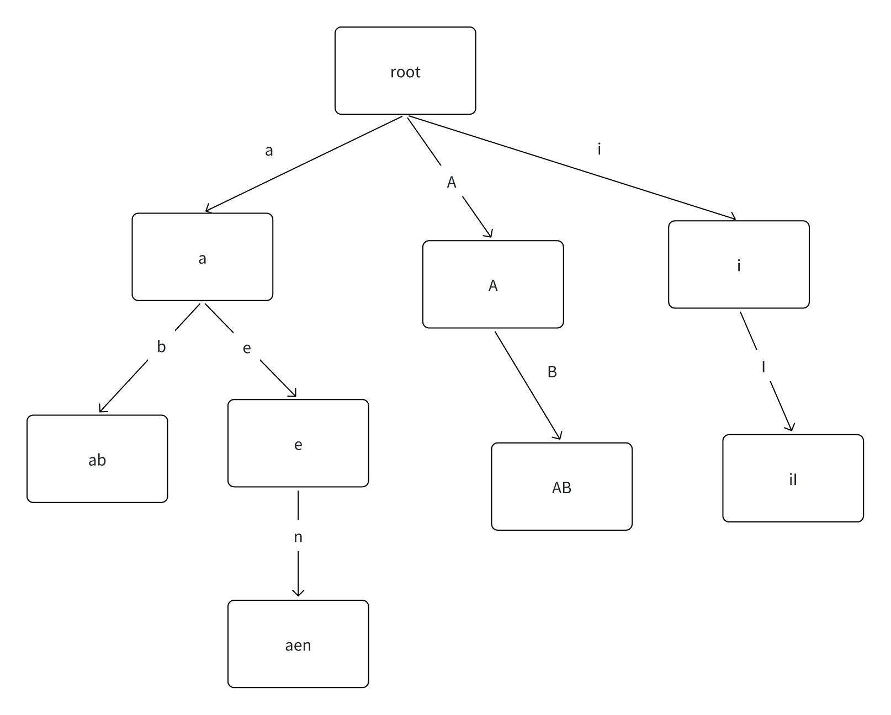
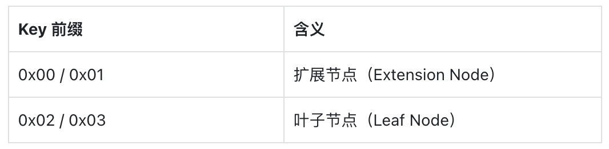
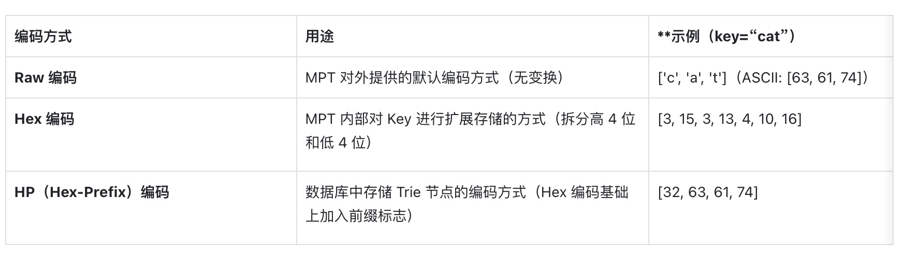
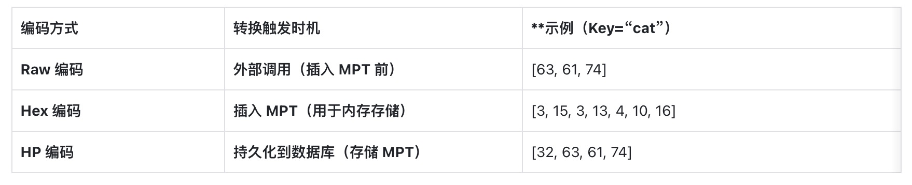

# 作者信息

| 用户名 | 推特 | 真实名字 | 简介 |
|--------|---------|------|--------|
| Seek | seek_web3 | ShiJiang.Guo | DappLink and The Web3 创始人, 曾就职于 Mantle, Bybit, 昆仑万维, HBTC, 币信, ChainUp, 云控蜂核, Achain, Linkeye, Kcash, Biwork, 华夏银行,中信银行|

# 第三节：前缀树与 MPT 树

## 一.前缀树
前缀树(字典树)：用来保存关联数组，它的键通常是一个字符串，前缀树的节点在树中的位置是由其键的内容决定，前缀树的 Key 是编码在根节点到该节点的路径中

[](https://github.com/the-web3)

在上图中共有 4 个叶子节点，分别是 ab, aen, AB, iI

### 1. 前缀树的优势
- 相比 Merkle,  使用前缀树来进行查询用拥有共同前缀 Key 的数据时是十分高效，但是最差的情况，仍然需要遍历整个树，复杂度 O(n),  对于前缀树来说，它的效率是merkle 树比高很多。

### 2. 前缀树的缺点
- O(n), n 次的 IO 开销，相比于直接查找，对磁盘的压力比较大
- 当 Key 比较长时，可能会造成空间的浪费

## 二. MPT 树
- MPT 树：是一种改良的，融合了默克尔树和前缀树两种树结构优点的数据结构，是以太坊中用来管理状态，交易，收据的数据结构

### 1. MPT 树的作用
- 可以存储任意长度的 key-value 的键值对数据
- 提供了一种高效快速计算维护数据集 Hash 标志的机制
- 提供了快速状态回滚机制
- 提供了一种称为Merkle的机制，进行轻节点验证扩展

在以太坊中，为 MPT 树新增了几种不同类型的树节点，以尽量压缩树高，降低操作的复杂度
MPT 树中有四种类型的节点
- 空节点
- 分支节点
- 叶子节点
- 扩展节点

#### 1.1 空节点
空节点用来表示空串。

#### 1.2 分支节点
分支节点（Branch Node） 是 MPT 树中拥有两个及以上子节点的非叶子节点，通过 Nibble 编码 降低存储开销，同时 增加树的高度。

它包含 16 个子节点指针，以及 存储自身值的额外字段，并使用 nodeFlag 记录哈希、脏标志和生命周期信息，优化性能和内存管理。

定义如下：

```
type fullNode struct {
    Children [17]node 
    flags    nodeFlag
}

type nodeFlag struct {
    hash  hashNode // cached hash of the node (may be nil)
    gen   uint16   // cache generation counter
    dirty bool     // whether the node has changes that must be written to the database
}
```
分支节点用于表示 MPT（Merkle Patricia Trie） 树中所有拥有两个或以上子节点的非叶子节点。

类似于前缀树，MPT 也将键（key） 编码到树的路径中。然而，以太坊中的键值范围较大（[0-127]），因此，在进行树操作前，会先对 key 进行编码转换：
- 每个字节的 高 4 位 和低 4 位 被拆分成两个单独的 Nibble（半字节） 存储。
- 这样，转换后的键 key' 的每个字符值范围变成 [0, 15]，使得每个分支节点最多拥有 16 个子节点。

这种编码方式降低了每个分支节点的存储需求，但增加了树的高度。

分支节点的结构

- 子节点列表（长度 16）：最多存储 16 个子节点（每个代表一个 Nibble）。
- 最后一个元素（第 17 项）：用于存储自身的值，即当前路径存储的 value（若存在）。

附加字段：nodeFlag
nodeFlag 记录了一些辅助信息：
-  节点哈希（Node Hash）：
  -  若不为空，可直接使用上次计算的哈希，避免重复计算
  -  当节点内容发生变化时，该字段被置空，触发重新计算
- 脏标志（Dirty Flag）
  - 当节点被修改时，该标志置为 1，标记为脏数据
- 诞生标志（Birth Flag）：
  - 当节点首次被载入内存或被修改时，赋予一个计数值，作为 清理机制的依据
  -  用于定期清理 “老旧且未修改” 的节点，防止占用过多内存

#### 1.3 叶子节点（Leaf Node）和扩展节点（Extension Node）
在 Merkle Patricia Trie（MPT） 中，叶子节点（Leaf Node） 和 扩展节点（Extension Node） 具有相似的结构，均由 shortNode 结构体表示：
```
type shortNode struct {
    Key   []byte
    Val   node
    flags nodeFlag
}
```
其中关键的字段为：
- Key：存储该节点所覆盖的 Key 前缀。
- Val：存储该节点的 内容（数据值或子节点）。
- flags：用于存储 节点元数据（如哈希、脏标志等）。

叶子节点（Leaf Node）
- 作用：存储 完整的 Key 路径 和 最终的 Value。
-  特点：
  -  Key：存储的是完整的剩余路径。
  - Val：存储的是实际的 value（终端数据）
- 终止条件：到达叶子节点后，不再向下遍历。

其中Key是MPT树实现树高压缩的关键！

##### 1.3.1 Merkle Patricia Trie（MPT）的路径压缩优化
在标准的 前缀树（Prefix Tree） 结构中，由于每个字符（或部分键）都需要一个单独的节点，因此可能会导致大量的 存储空间浪费。MPT 通过路径压缩（Path Compression） 解决这一问题，减少冗余节点，提高存储和查询效率。

###### 1.3.1.1 MPT 的路径压缩优化
问题：在普通前缀树中，如果插入的键 toast，但当前树结构中并不存在以 t 开头的路径，则需要逐个创建节点 来存储 t → o → a → s → t。这会导致：
- 存储空间浪费：大部分非叶子节点只是路径的一部分，并不存储实际数据。
- 查询效率低：查询 toast 需要遍历多个无效节点，导致更多的磁盘访问（I/O）。
  - MPT 解决方案：
    - 当插入一个键时，如果发现没有现有路径与该键的前缀匹配，则直接将剩余的键 存储在叶子节点（Leaf Node）或扩展节点（Extension Node） 的 Key 字段中，而不创建冗余路径。
    - 这样，叶子节点和扩展节点的 Key 充当了一种“Shortcut”，减少不必要的层级，提高查找效率。

###### 1.3.1.2 示例分析
假设我们插入以下两个键：
- toast
- top


普通前缀树（未优化）：

```
t
|
o
|
a
|
s
|
t  (存储值)
```
如果再插入 top，它将 从 o 节点开始创建新的分支，最终形成：

```
t
├── o
│   ├── a → s → t  (存储 "toast" 的值)
│   └── p  (存储 "top" 的值)
```

可以看到 toast 和 top 共享前缀 to，但仍然需要单独创建多个节点。


MPT 经过路径压缩后的结构：

```
t → o
   ├── ast (存储 "toast" 的值)
   └── p   (存储 "top" 的值)
```

- 在这里：
  - to 作为扩展节点（Extension Node），指向两个子路径
  -  ast 直接存储在叶子节点中，而不是拆分为多个单独的字符节点。

###### 1.3.1.3 扩展节点（Extension Node）和叶子节点（Leaf Node）在数据库中的存储
在 MPT 中，每个扩展节点和叶子节点的 Val 字段可以存储：
- 哈希索引（存储在数据库中的节点索引值）
- 直接引用（指向内存中的子节点）

这种设计的原因：
- 如果整棵 MPT 持久化到数据库，则必须存储子节点的哈希索引，确保持久化后的树结构仍然可被解析。
- 如果数据在内存中，可以直接使用指针引用，避免额外的数据库查询，提高访问速度。

优点：
- 保持父子节点的关联，即使树存储在数据库中，也能通过哈希索引找到子节点。
- 减少磁盘 I/O：
  - 如果当前节点已包含所需数据，则无需再读取子节点。
  -  如果当前节点需要更多数据，则递归查询子节点的哈希索引。
  
###### 1.3.1.4 如何区分 Val 字段存储的是数据还是哈希索引？
在以太坊的 MPT 实现中，通过 Key 中的特殊标志来区分：
- 叶子节点（Leaf Node）：Val 存储的是最终的数据值。
- 扩展节点（Extension Node）：Val 存储的是子节点的哈希索引。

以太坊采用 Nibble（半字节）编码，并在 Key 的第一个字节添加前缀来区分：

[](https://github.com/the-web3)

- 如果 Key = 0x03 | "ast"，表示：
  - 0x03（叶子节点标志）
  -  ast（存储路径）
  -  Val 存储的是最终的数据值。

- 如果 Key = 0x01 | "to"，表示：
  - 0x01（扩展节点标志）
  - to（存储路径）
  - Val 存储的是子节点的哈希索引。

### 2. 以太坊 MPT（Merkle Patricia Trie）中的 Key 编码方式详解
在以太坊的 MPT（Merkle Patricia Trie）树中，Key 的编码 主要有三种不同的形式，分别用于不同的场景：

[](https://github.com/the-web3)


#### 2.1 Raw 编码
定义：Raw 编码就是未经转换的原始 Key，它是 MPT 对外接口默认使用的编码方式。
存储方式：直接存储 Key 的字符，不做任何转换。
示例：如果 key 为 "cat"，其 Raw 编码 为：
```
['c', 'a', 't']
```
换成 ASCII 数值：
```
[63, 61, 74]  // ASCII of 'c' = 63, 'a' = 61, 't' = 74
```

#### 2.2 Hex 编码
为了优化 MPT 的存储结构，以太坊使用 Hex 编码（16 进制扩展编码）：

原因：原始 Key 的每个字符（byte）范围是 [0-127]，这样会导致分支节点需要 128 个子节点。为了减少存储空间，以太坊对 Key 进行转换：
- 每个字符（byte）拆分为 两个 Nibble（半字节, 4-bit），使其值范围变成 [0-15]（即 16 叉 Trie）。
- 这样，每个分支节点最多只有 16 个子节点，大大减少了存储空间。

Hex 编码转换规则：
- 拆分每个字节的高 4 位和低 4 位，分别存储：
  - 例如 "c"（ASCII 0x63），拆分成 0x6 和 0x3
- 如果该 Key 对应的节点是叶子节点（Leaf Node），则在末尾添加 0x10 作为终止标记；
- 如果该 Key 对应的是扩展节点（Extension Node），则不添加终止标记。

Hex 编码转换示例
- 如果 Key 为 "cat"，其 ASCII 码值分别为：
```
'c' -> 0x63
'a' -> 0x61
't' -> 0x74
```
- 拆分成高 4 位和低 4 位：
```
'c' -> 0x6  0x3
'a' -> 0x6  0x1
't' -> 0x7  0x4
```

然后转换为 Hex 编码：
```
[3, 15, 3, 13, 4, 10, 16]  // 最后 16 代表叶子节点终止符
```
Hex 编码用途
- Hex 编码用于 Trie 内部存储，以减少存储空间，提高查询效率。

#### 2.3 HP（Hex-Prefix）编码
问题：
- 在 MPT 中，叶子节点（Leaf Node）和扩展节点（Extension Node）共享相同的数据结构。
-  但是，当树存储到数据库中时，需要区分这两种节点类型，因此以太坊引入了 HP 编码（Hex-Prefix 编码）。
- HP 编码用于数据库存储的 Trie 节点 Key

HP 编码转换规则
- 如果 Key 末尾为 0x10（表示叶子节点），去掉这个标记
- 在 Key 之前添加一个前缀半字节（Nibble）
  - 最低位（LSB, Least Significant Bit）：
    -  记录原 Key 长度的奇偶性:
      - 奇数长度 → 1
      - 偶数长度 → 0
  - 低 2 位编码终止标记：
    - 叶子节点（Leaf Node） → 1
    - 扩展节点（Extension Node） → 0
- 如果 Key 长度是奇数，在 Key 之前再增加一个 0x0 的半字节
- Hex 编码转换回字节存储（逆转换）

HP 编码转换示例
- 如果 Hex 编码 为：
```
[3, 15, 3, 13, 4, 10, 16]
```
- 进行 HP 编码转换：
  - 去掉末尾 16（叶子节点终止标志）：
```
[3, 15, 3, 13, 4, 10]
```
  - 确定 Key 长度的奇偶性：
    - Key 长度 = 6（偶数），最低位 = 0
    - 叶子节点，终止标记 = 1
    - 因此前缀半字节 = 0b0010（即 0x2）
  - 重新编码回字节存储
```
[32, 63, 61, 74]
```
    - 0x2 → 代表偶数长度的叶子节点
    - 0x3F → 原始 Key 的编码
    - 0x3D
    - 0x4A
    
HP 编码用途
- HP 编码用于数据库存储，确保持久化后的 MPT 节点可以正确区分 叶子节点和扩展节点。
- 当 Trie 节点从数据库加载到内存时，HP 编码会被转换回 Hex 编码。

#### 2.4 三种 Key 编码的转换关系

```
Raw 编码（原始 Key）  ——>  转换成 Hex 编码（用于 MPT 内存存储）  ——>  转换成 HP 编码（用于数据库存储）
                                （当数据项被插入到 MPT 时）
                                （当 MPT 节点被持久化到数据库时）
                                （当 MPT 节点从数据库加载到内存时）
```

[](https://github.com/the-web3)


### 3. 安全的 Merkle Patricia Trie（MPT）
在标准的 MPT（Merkle Patricia Trie）中，Key 可以是任意长度的字符串，这会导致：
- 树的深度无限增长，影响查询性能；
- 易受 DoS 攻击，攻击者可以构造极端情况拖慢 SLOAD 操作；
- Key 以明文存储，缺乏隐私保护。

为了解决这些问题，以太坊对 MPT 进行了封装优化，即使用 Key 的哈希值 sha3(key) 作为 MPT 存储的实际 Key。

#### 3.1 MPT 直接存储明文 Key 的问题
在原始 MPT 设计中：
- Key 没有限制，可能很长，导致 Trie 变得非常深
- 例如，如果存储以下数据项：
("aaaaaaaaa...", value1)
("aaaaaaabbb...", value2)
由于 Key 很长，会导致 Trie 的 深度很大，查询需要遍历很多层，影响性能。

攻击者可以利用这一特性发动 DoS 攻击：
- 通过存储特定模式的数据（如大量长 Key），构造 单条长路径的 MPT，让查询变得非常慢
- 之后不断调用 SLOAD（状态存储读取指令） 访问该数据，造成合约 Gas 费用极高，拖慢整个以太坊网络

- Key 以明文形式存储，容易暴露隐私信息：
  - 例如，存储 账户地址 0x1234... 作为 Key，会暴露该账户的状态。

#### 3.2 以太坊的安全优化：Key 哈希化

##### 3.2.1 方案
解决方案：在存入 MPT 之前，先对 Key 进行 SHA3（Keccak-256）哈希 计算：
MPT 真实存储的数据项：
( sha3(key), value )
即：
- 不再存储原始 Key，而是存储其 SHA3 哈希值。
 
- 示例
Key:   "cat" -> SHA3("cat") = 0x82a...f90
Value: "dog"
- 最终存入 MPT 的数据项：
(0x82a...f90, "dog")

##### 3.2.2 优势
- Key 变为固定长度（32 字节）
  - 避免了 Key 过长导致 MPT 深度增长的问题，提升查询性能。
  - MPT 树的深度保持稳定，提高存储效率。
- 防止 DoS 攻击：
  - 由于 Key 经过哈希处理，攻击者无法构造超长路径来拖慢查询速度。
  - 避免了 SLOAD 读取深层节点时的 高 Gas 消耗问题。
-  增强隐私保护：
  - 原始 Key 不直接暴露，外部无法直接知道存储的数据 Key 是什么。
 例如：
sha3("Alice's Account") = 0xabc123...
sha3("Bob's Account")   = 0xdef456...
外部只能看到 0xabc123...，而不会直接知道 “Alice’s Account” 的信息。

##### 3.2.3 劣势
尽管该方法提高了安全性，但也引入了一些额外的开销：
每次存取数据时都需要计算 sha3(key)：
- 增加了一次哈希计算的 CPU 开销，略微影响性能。
需要存储 sha3(key) → key 的映射关系：
- 因为以太坊智能合约执行时，用户可能只知道原始 Key，但 MPT 只存储了 sha3(key)。
- 因此，需要一个额外的数据库表来存储映射关系：
(key → sha3(key))
这样，在查询时，可以通过先计算 sha3(key)，再查找数据。

## 五.MPT 的基本操作

### 1.Get 操作（查找 Key）
MPT 的 Get 操作用于查找某个 Key 对应的 Value。其过程如下：
- 将 Raw 编码的 Key 转换成 Hex 编码（每个字符拆成两个半字节，并在末尾加 0x10 作为叶子节点终止符）。
- 从根节点开始，按照搜索路径查找：
  -  扩展节点：
    - 若当前节点是扩展节点，且存储的是哈希索引，则从数据库加载该节点，并递归调用查找函数
    - 若当前节点的 Key 是搜索路径的前缀，则继续在子节点查找，否则该 Key 不存在。
  - 分支节点：
    - 若搜索路径为空，则返回分支节点的 Value。
    - 若搜索路径不为空，则按照搜索路径的第一个字节选择子节点，并递归查找。
  -  叶子节点：
    - 若叶子节点的 Key 与剩余搜索路径完全匹配，则返回 Value。
    - 否则，该 Key 不存在。

示例：查找 Key “cat”
- Key "cat" 的 Hex 编码为：
[3, 15, 3, 13, 4, 10, 16]  // 最后 16 表示叶子节点终止符
- 从根节点开始搜索：
  - 根节点是扩展节点，Key 为 [3, 15]，匹配搜索路径前缀 [3, 15]，继续搜索子节点，剩余路径为 [3, 13, 4, 10, 16]。
  - 进入分支节点，搜索路径的第一个字节是 3，选择分支 3，继续搜索，剩余路径为 [13, 4, 10, 16]。
  - 进入叶子节点，Key 为 [13, 4, 10, 16]，完全匹配剩余搜索路径，查找成功，返回 Value = "dog"。

### 2. Insert 操作（插入 Key-Value）
插入操作的步骤：
- 先执行 Get 操作，找到与新 Key 拥有最长相同前缀的节点，记为 Node。
- 根据 Node 类型进行插入：
  - 分支节点：
    - 若剩余搜索路径不为空，则插入新的叶子节点到合适的子节点位置。
    - 若剩余搜索路径为空（完全匹配），则更新分支节点的 Value。
  - 叶子/扩展节点：
    - 若剩余路径与当前节点的 Key 完全匹配，则更新 Value。
    - 若不匹配：
      - 创建新的分支节点，存放 当前节点与新 Key 的共同前缀。
      - 将当前节点和新节点作为 两个子节点 存入 分支节点，并将当前节点转为 扩展节点。
- 标记被修改节点为 dirty，清空 hash，更新诞生标记。

示例：插入 Key “cau”

- Hex 编码：
[3, 15, 3, 13, 4, 11, 16]  // "cau" + 终止符
- 查找最长前缀节点（Node1）。
- 创建新的分支节点 Node2，插入 cau 和 cat：
  - Node1 变成扩展节点。
  - Node2 成为分支节点，存储分支 [11]（“u”）和 [10]（“t”）。

### 3.Delete 操作（删除 Key）
删除操作与 Insert 类似：
- 先执行 Get 操作，找到 Key 最长匹配的节点 Node。
- 删除逻辑：
  -  叶子/扩展节点：
    - 若搜索路径与 Node 的 Key 完全匹配，直接删除。
    - 若不匹配，则 Key 不存在，删除失败。
  - 分支节点：
    - 删除子节点，若删除后只剩一个子节点，则将其合并成叶子/扩展节点。

示例：删除 Key “cat”

- 找到 cat 对应的叶子节点。
- 删除节点，导致父节点只有一个子节点：
  - 分支节点变成叶子节点
  - 扩展节点和叶子节点合并。

### 4.Update 操作
- Update(Key, Value) 相当于 Insert（如果 Value 不为空）。
- Update(Key, NULL) 相当于 Delete

### 5.Commit 操作（持久化 MPT）
Commit 操作用于 将 MPT 结构持久化到数据库，同时 计算新的根哈希。
-  递归遍历 MPT 树，计算每个节点的哈希：
  - 若节点未修改，直接返回 缓存的哈希值。
  - 若节点被修改，重新计算哈希：
    - 子节点的哈希 递归计算。
    - 当前节点哈希计算：
      -  RLP 编码当前节点数据
      - 计算 sha3(RLP(data)) 作为 新哈希
    - 存入数据库：[节点哈希, RLP 编码]
    - 更新缓存，清除 dirty 标志。

## 六.MPT 在区块链中的应用
- 快速计算数据集哈希
  - 只有被修改的节点及其祖先节点需要重新计算哈希，提高效率。
- 快速状态回滚
  - 以太坊可能发生区块回滚，MPT 允许零延迟恢复历史状态。
  - 原理：
    - 每个节点的哈希值是唯一且不可变的
    - 当状态变更时，只需替换变更节点的哈希索引，旧状态仍然可访问。
    - 无需删除旧数据，状态回滚时，只需切换到旧根哈希。

